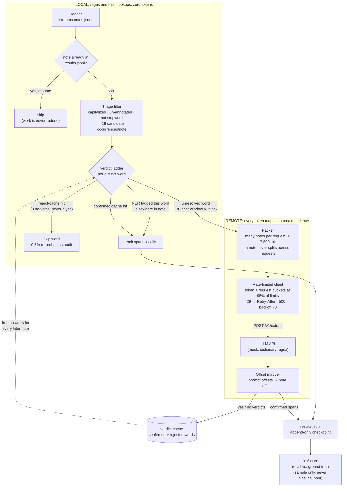
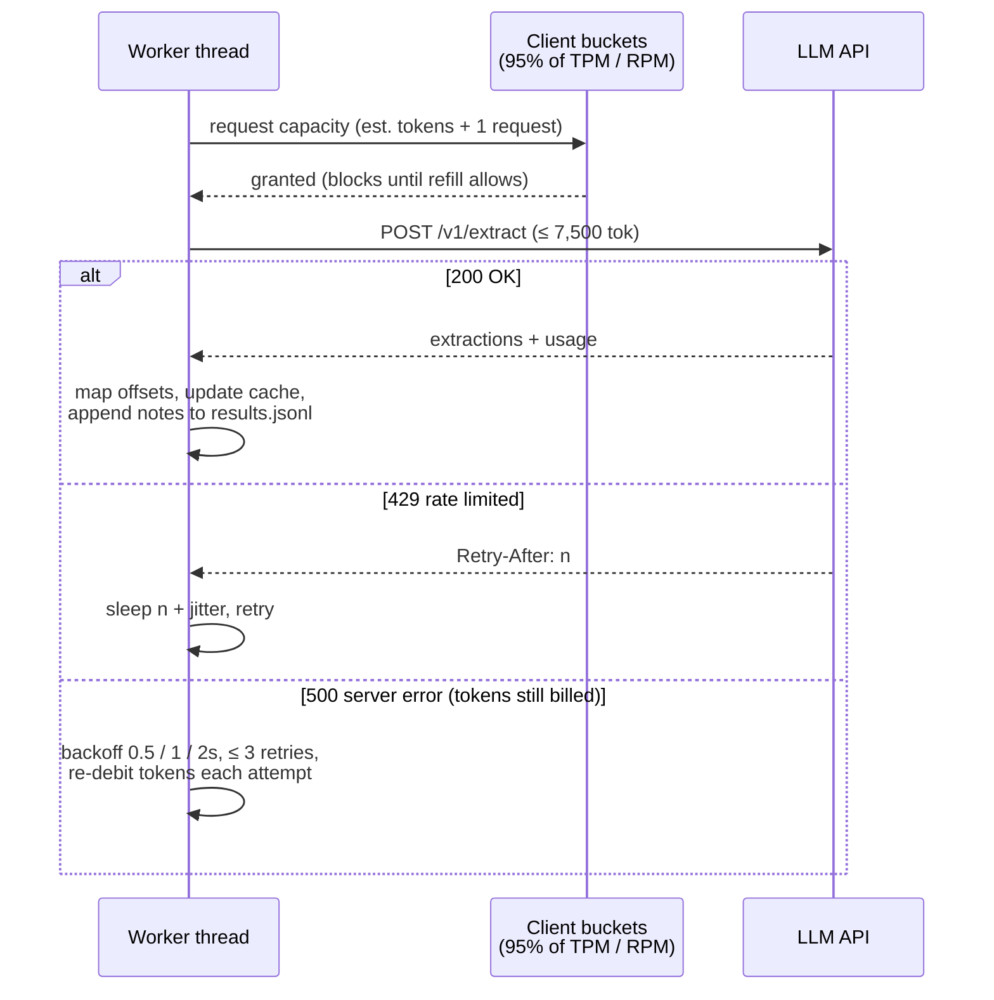

# DESIGN: Backstopping first-name NER with an LLM

Plain Ruby (stdlib only, no gems, any Ruby 2.6 or newer) against the provided mock API.

## How to run

```bash
# terminal 1
make server        # python3 mock_api/server.py --port 8000 --seed 42 --error-rate 0.02

# terminal 2
make run           # 500-note demo slice   (ruby bin/pipeline --limit 500)
make run-all       # all 5,000 sample notes
make score         # grade out/results.jsonl against ground truth
make clean         # remove output + resume checkpoint
```

The output is `out/results.jsonl`, one line per note: `{"note_id", "missed_first_names": [{"text","start","end","source"}]}`. Offsets point into the original note text. Re-running resumes where the last run stopped, and `bin/pipeline --help` lists the flags.

**Measured on the full 5,000-note sample:** the pipeline caught all 6,905 first names the NER missed, lifting combined recall from 60.45% to 100%. It spent 122,469 tokens in total, about 24.5 per note, where sending whole notes would have cost 595 per note, a 24-fold reduction. It made 17 requests, resolved 3,074 of the 5,000 notes without spending any API tokens at all, and produced 63 false-positive spans (0.36%, all in the safe over-redaction direction). Killing the process partway through and rerunning finishes the job with an identical score.

## Architecture

The system is a single batch pipeline organized around one boundary: everything on the local side is regex and hash lookups and costs nothing, while everything that crosses to the remote side spends tokens from a fixed budget. The design pushes as much work as possible to the left of that boundary, and every arrow that crosses it corresponds to a line in the cost model below.

A note streams in, is checked against the resume checkpoint, and has its candidate words extracted by the triage filter. Each distinct word then climbs a verdict ladder: resolved free if the NER vouched for it in the same note or the cache already knows it, skipped if the cache has firmly rejected it, and only otherwise packed into an LLM request as a ~15-token snippet. The LLM's answer flows back into the cache, so each distinct word is paid for a handful of times across the whole corpus rather than once per occurrence.



Each component exists to control exactly one quantity in the throughput math, which is what makes the arithmetic auditable against the code:

| Component | Quantity it controls | Value |
|---|---|---|
| Triage filter | candidates per note $\bar{c}$, and filter recall | 19/note; 100% of NER misses on sample |
| Snippet windows | tokens per LLM look $t_w$ | 15 |
| Verdict cache | turns $N \cdot \bar{c}$ occurrences into $V \cdot K$ bootstrap looks + tail | 9M + 143M tokens |
| Audit streams | the risk bounds ($p_{\text{audit}}$, $p_{\text{full}}$) | 14M + 12M tokens |
| Packer | request count vs. the 2.4M request budget | ~24k requests |
| Client buckets | wall clock $(T - B) / (0.95 \times \text{TPM})$ | ~47 min |
| results.jsonl checkpoint | cost of a crash | only in-flight notes rerun |

The request path is where the vendor's failure modes live, and the client's contract is simple: never send before capacity exists, obey the server when it pushes back, and pay for retries honestly.



Concurrency is deliberately boring. One reader thread does triage and packing, a small pool of worker threads drives the HTTP requests (the workload is IO-bound, so Ruby's GIL is irrelevant), and all shared state (the two buckets, the verdict cache, and the results file) sits behind mutexes. Scaling to production means more workers and a shared cache, not a different diagram.

## What we send vs. what we don't

The pipeline never sends a whole note. A free local pass finds candidate words: capitalized tokens that sit outside every existing annotation (the other entity types are trusted, so anything inside them is being redacted regardless) and are not on a short list of clinical stopwords. On the sample this yields about 19 candidate occurrences per note, and every name the NER missed was among them.

Most candidates never reach the API. A candidate that matches a FIRST_NAME string the NER tagged elsewhere in the same note is confirmed on the spot, and a candidate the verdict cache already knows is resolved just as cheaply. Only the words that remain unresolved are sent, each as a single snippet consisting of the word plus thirty characters of context on either side, about 15 tokens. One snippet per distinct word per note is enough, because once the LLM confirms a word the pipeline finds its other occurrences with a local string match.

The verdict cache is what makes the economics work across notes. The candidate vocabulary is small and extremely repetitive: the sample contains only about 135 distinct candidate words, and 99.9% of occurrences are repeats. A single yes from the LLM confirms a word everywhere, which is the safe direction because the worst case is over-redaction. A no must be repeated in three different notes without a single confirmation before the word is skipped, and even then half a percent of skipped occurrences are re-sent as audit probes. In steady state almost every note resolves entirely from the cache and costs nothing.

Finally, snippets from many notes are packed into each request, capped at 7,500 tokens to leave margin under the 8,000-token limit. A note's snippets always travel together in one request, which makes the note the atomic unit of completion and keeps the resume logic simple.

## Throughput math (10M notes, production limits)

Every number below is either **measured on the 5,000-note sample** (the README states the sample is distribution-fair, so per-note measurements extrapolate to the corpus) or a **deliberately pessimistic assumption**. The table says which, and by how much each assumption pads the measurement.

**Token accounting** (the vendor's billing rule, mirrored by the mock): $\text{tokens} = \lceil \text{chars}/4 \rceil$ of the prompt sent.

| Symbol | Meaning | Value | Provenance |
|---|---|---|---|
| $N$ | notes in the corpus | $10^7$ | given |
| $W$ | batch window | 240 min | given |
| $\bar{t}$ | tokens per whole note | 595 | **measured**: notes average ~2,380 chars; 2,380 ÷ 4 ≈ 595 (range 135–1,306) |
| $t_w$ | tokens per snippet window | 15 | by construction: word ± 30 chars ≈ 60 chars; 60 ÷ 4 = 15 |
| $\bar{c}$ | candidate occurrences per note | 19 | **measured**: triage-filter output over all 5,000 notes (≈ 12.6 *distinct* words/note) |
| $V$ | distinct candidate words, whole corpus | 200,000 | **assumed**: measured 135 on the sample, but synthetic text understates vocabulary, so padded ~1,500× |
| $K$ | LLM looks per word before its verdict settles | 3 | design constant: one "yes" confirms, three distinct-note "no"s reject; worst case assumed for every word |
| $p_{\text{tail}}$ | occurrences the cache never resolves | 5% | **assumed**: measured < 1% on the sample; padded ~5× |
| $p_{\text{audit}}$ | reject-cache skips re-probed anyway | 0.5% | design tunable (see Risk) |
| $p_{\text{full}}$ | notes sent whole as a filter audit | 0.2% | design tunable (see Risk) |

**Budgets over the window** $W = 240$ min:

$$T_{\text{budget}} = 4\text{M} \tfrac{\text{tok}}{\text{min}} \times 240 \text{ min} = 960\text{M tokens} \qquad R_{\text{budget}} = 10\text{k} \tfrac{\text{req}}{\text{min}} \times 240 \text{ min} = 2.4\text{M requests}$$

**Rejected approaches** ($N = 10^7$ notes):

$$T_{\text{whole notes}} = N \cdot \bar{t} = 10^7 \times 595 = 5.95\text{B} \approx 6.2 \times T_{\text{budget}} \quad ✗$$

$$T_{\text{snippets, no cache}} = N \times 176 = 1.76\text{B} \approx 1.8 \times T_{\text{budget}} \quad ✗$$

(176 tok/note is **measured**, by running triage and windowing over the sample with caching disabled: about 12.6 windows per note at ~14 tokens each after merging overlaps. Snippets cut the cost 3.4× but still miss the budget; the verdict cache closes the remaining gap.)

**This design.** Total spend = (learn the vocabulary once) + (the tail the cache never absorbs) + (both audit streams) + (retries):

| Component | Formula | Tokens |
|---|---|---|
| Vocabulary bootstrap | $V \cdot K \cdot t_w = 200\text{k} \times 3 \times 15$ | 9M |
| Never-cached tail | $N \cdot \bar{c} \cdot p_{\text{tail}} \cdot t_w = 10^7 \times 19 \times 0.05 \times 15$ | 143M |
| Reject-cache probes | $N \cdot \bar{c} \cdot p_{\text{audit}} \cdot t_w = 10^7 \times 19 \times 0.005 \times 15$ | 14M |
| Full-note audits | $N \cdot p_{\text{full}} \cdot \bar{t} = 10^7 \times 0.002 \times 595$ | 12M |
| Retry overhead | ≈ 2% of the above (500s consume tokens) | +4M |
| **Total** | | **≈ 182M tokens (19% of the 960M budget)** |

As a cross-check from measurement rather than assumptions, the sample run spent 24.5 tokens per note, which extrapolates to $10^7 \times 24.5 = 245\text{M}$ (26% of budget). Either way, **headroom is roughly $960/182 \approx 5\times$**, so the design survives its assumptions being wrong by a factor of four or five.

**Wall-clock time.** Rate limits behave as a continuously-refilling bucket: capacity equals one minute's allowance, the bucket starts full, and it refills at allowance ÷ 60 per second. Spending $T$ tokens therefore takes $(T - B) / \text{rate}$, where $B$ is the free initial bucketful. The client paces itself at **95% of every limit** (a safety margin that keeps 429s the exception), so the effective rate is $0.95 \times 4\text{M} = 3.8\text{M}$ TPM. Three candidate bottlenecks; the slowest sets the wall clock:

$$t_{\text{tokens}} = \frac{T - B}{0.95 \times \text{TPM}} = \frac{182\text{M} - 3.8\text{M}}{3.8\text{M/min}} \approx 47 \text{ min}$$

$$t_{\text{requests}} = \frac{T / 7{,}500 \text{ tok/req}}{\text{RPM}} = \frac{\approx 24\text{k req}}{10\text{k/min}} \approx 2.4 \text{ min} \qquad t_{\text{latency}} = \frac{24\text{k} \times 1.5\text{s}}{64 \text{ workers}} \approx 9.4 \text{ min}$$

$$t_{\text{wall}} \approx \max(47,\ 2.4,\ 9.4) \approx 47 \text{ min} \quad (\text{at the measured } 245\text{M}: \approx 64 \text{ min}) \ \ll\ 240 \text{ min} \quad ✓$$

The token bucket is the only binding constraint; RPM and latency never come close. Local triage is a regex pass (~µs/note): $10^7 / 240$ min ≈ 700 notes/s, trivially sharded across a few worker processes.

**Model validation at mock scale (1/100 limits):** the same formula predicts the prototype run. The mock allows 40,000 TPM; at the same 95% pacing the client's self-imposed budget is $0.95 \times 40{,}000 = 38{,}000$ TPM: a bucket of capacity $B = 38{,}000$ refilling at $38{,}000 / 60 \approx 633$ tokens per second. Measured spend was 122,469 tokens:

$$t_{\text{predicted}} = \frac{122{,}469 - 38{,}000}{633} = 133.4\text{s} \qquad t_{\text{measured}} = 133.7\text{s}$$

The pacing model matches reality to within 0.3s, which is what licenses extrapolating it 100× to production limits.

## Failure story

**Rate limits (429).** The client never uses 429s as its pacing mechanism. It keeps its own token and request buckets set to 95% of the vendor's limits and waits for capacity before each send, so under normal operation it never asks for more than the API will give. When a 429 arrives anyway, the client sleeps for the number of seconds in the server's `Retry-After` header plus a little jitter, then tries again. Sustained test runs at the mock's limits produced between zero and five 429s, all absorbed without losing any work.

**Server errors (500).** A failed request is retried up to three times with exponential backoff (0.5s, 1s, 2s, plus jitter). The vendor bills tokens even for failed requests, so every retry is debited from the client's budget again. A batch that exhausts its retries is logged and its notes are left unwritten; the next run picks them up automatically. At the observed 1–2% error rate, three consecutive failures are about a one-in-a-million event per batch.

**A crash at hour two.** The output file is the checkpoint. Every completed note is appended and flushed as one line of `results.jsonl`, so at any instant the file is a complete record of finished work. On restart, the pipeline reads it, skips every note already present, and rebuilds the confirmed-name cache from the recorded spans. The reject cache is not persisted; it simply re-learns, which costs a few extra tokens and no correctness. We tested this by killing the process with `kill -9` mid-run: the restart skipped the 3,480 finished notes and produced the same final score as an uninterrupted run. At 10M scale the input is sharded, with one checkpoint file per shard.

**How we know it's still on track.** The pipeline prints notes per second, tokens spent, error counts, and a projected finish time every five seconds. In production the same numbers feed a dashboard, with an alert if the projected finish drifts past the window minus a safety margin. Since token spend is the binding constraint, tokens spent versus tokens budgeted at this point in the run is the single most useful health metric.

## Risk

The pipeline only sends the LLM what its local filter flags, so the honest question is: what could the filter miss, and how would we know on data that has no answer key?

**Names the candidate regex can't see.** The filter looks for capitalized words of three or more letters. A name typed in lowercase, a two-letter name like "Al", or an unusual hyphenated form would never become a candidate. This never happened on the sample (the filter caught 100% of the NER's misses), but the sample is synthetic, so we don't rely on that. Instead, the pipeline sends one in every 500 notes to the LLM in full and compares what the LLM finds against what the pipeline produced. Any name found this way that the filter never proposed is counted and logged as a filter miss. If 20,000 audited notes turn up zero misses, the rule of three bounds the true miss rate below roughly 0.015% of notes with 95% confidence. Because this audit runs continuously, drift in real data would surface during the run rather than after it.

**Wrongly rejecting a real name.** The dangerous ambiguity is a word like "Grace": a name in one note, a common noun in another. Three safeguards keep a wrong rejection from sticking: a word is only skipped after the LLM has rejected it in three different notes and never once confirmed it; even then, skipped occurrences are re-sent 0.5% of the time as probes; and a single confirmation anywhere reverses the rejection permanently. The sample run needed zero reversals. One prototype gap: a reversal does not go back and re-scan the notes that were skipped before it; production would, using a persisted log of what was skipped and why.

**Over-redacting.** The word-propagation shortcut copies the NER's own rare mistakes: the model tagged "Will" as a first name once, so the pipeline flagged every "Will continue to monitor" in that note too. This produced 63 false spans out of 17,459 names (0.36%). For de-identification this is the right direction to err, because an over-redacted word leaks nothing, and the scorer tracks the rate.

**The mock versus a real LLM.** Word-level caching works flawlessly here because the mock really is context-free. A real LLM's answers depend on context, and that is exactly the uncertainty the three-rejection threshold and both audit streams exist to absorb. Their rates are stated as tunables; we deliberately did not tune them against the mock's internals, because a solution fitted to the simulator proves nothing.

## Production deltas

The prototype is one process on a laptop; production is the same algorithm in a sturdier harness. The corpus is sharded across a few dozen workers, each holding a fixed slice of the rate budget (a small token-broker service if a static split wastes too much). The verdict cache and the done-set move from process memory and a local file into a shared store such as Redis, so workers learn from each other's confirmations and restarts are instant. Work flows through a durable queue, with a dead-letter queue for the rare batch that exhausts its retries. A real LLM needs an instruction prompt and structured output, which adds a constant per-request overhead the same packing amortizes, plus schema validation on responses. And because even snippets contain PHI, the endpoint has to be covered by a BAA.

## Simplifications taken

These shortcuts were taken knowingly, to fit the timebox. The stopword list is hand-built rather than derived from corpus word frequencies; a real name that collides with it would be invisible to the filter, which is one of the things the full-note audit exists to catch. A rejection reversal does not re-scan previously skipped notes. Two in-flight batches can ask about the same word before either answer lands, wasting a few tokens harmlessly. And the pipeline is single-process, which comfortably saturates the mock's limits; scaling out is a deployment change, not an algorithm change.
